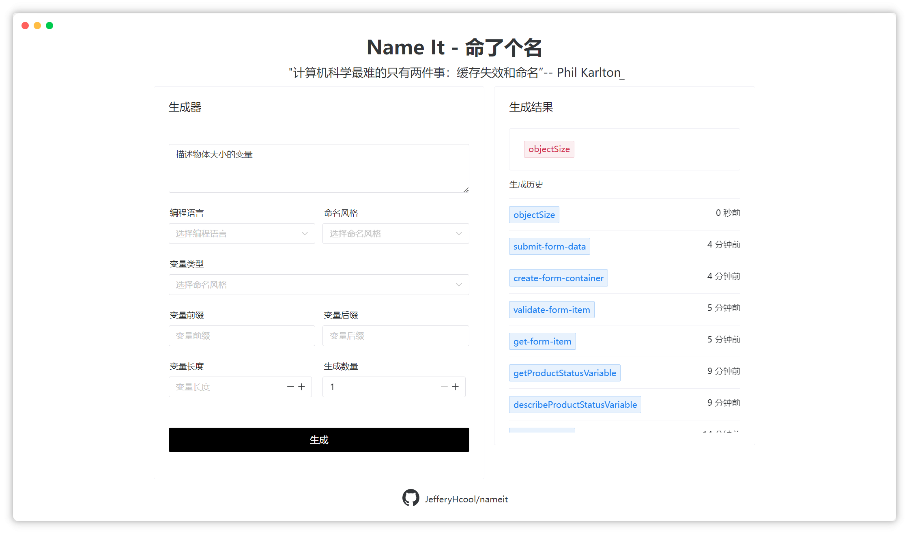

<div align="center">
  <h1>Name IT - 命了个名</h1>
</div>

<a href="https://www.sinoute.club/#/">
  </a>

## 🎉项目起源

想必每位编程的朋友都曾在给变量命名时遇到过困难。你是否曾苦思冥想，最终却只能用像`a1`、`tempA`、`blm`这样的不规范、难以理解且不易维护的名称？这并不是你的错，即便是经验丰富的程序员也会遇到这个问题。在计算机界，有这样一句著名的话：

> "计算机科学最难的只有两件事：缓存失效和命名”
>
> -- Phil Karlton

但随着大型模型的崛起，这看似难以解决的问题也许可以得到缓解。如果将编程中的一大难题——命名，交给人工智能处理，会怎样呢？这个项目便是基于这样一个想法诞生的。希望借助AI的力量，解决编程过程中的这一**_难题_**，让命名变得更加直观和简单。

## 🚀 Try It Out!

🆕[体验地址](https://www.sinoute.club/#/) 为了更好的使用结果，**每分钟**只允许**20次请求**。

## 🌟 最近更新

- 23年12月26日 - 项目初始化，可以从体验地址使用 `nameit` 命名生成器了。 

## ✨ 特性一览

如果你也用过大佬的 [CODELF](https://unbug.github.io/codelf/) 你应该知道这个项目对于一些比较偏门或不够语义化的变量名的生成不是特别友好，所以本项目基于 ChatGPT 这样就很好的解决了这个问题。

1. **支持语义化的描述变量名**

   **Name IT** 强调语义化命名的重要性，你可以语义化的描述变量。

   > 📝 为了获得最佳效果，我们推荐您遵循**简洁明了**的原则
   >
   > - **明确表达**：用清晰、具体的词语描述变量的用途和功能，避免模糊或过于泛泛的描述。
   > - **简洁精炼**：尽量减少不必要的词汇，直接传达核心意图。

   

2. **丰富的生成控制**

   **Name IT** 提供了多种灵活的选项，让您可以根据自己的需求定制变量名的生成：

   - **编程语言**：选择合适的编程语言（目前只涵盖主流）
   - **命名风格**
   - **变量的类型**：可以是文件、函数、类......
   - **前缀、后缀**：变量生成时是否会有前缀或后缀
   - **变量的长度**：最大为10 最小为2
   - **生成数量**：一次生成的数量，目前只支持一次性最大8个变量


3. **历史列表**

   为了确保您不错过任何一个生成的变量名，以及方便复用之前的结果，**Name IT** 提供了一个便捷的`生成历史`功能。此功能将记录您的所有生成结果，并且完全基于您的本地环境：

   - **本地存储**：所有生成的变量名将被保存在您的本地 **localstorage** 中，确保您随时可以回顾和复用。
   - **隐私保障**：我们重视您的隐私。因此，您的生成历史不会在服务器上保存，只存在于您的本地设备上。
   - **方便查阅**：您可以轻松查看过去的生成结果，无论是为了参考还是再次使用，点击即可复制。

## 🛠 开始使用

NameIT 提供了 Docker 的方法部署，这使你可以在几分钟内构建自己的 AI 变量生成器。

### Docker 部署

1. 准备好你的 [OpenAI API Key](https://platform.openai.com/account/api-keys) 。

2. 将` backend/setting/config.example.py` 复制出来并且改为 ` backend/setting/config.py`

   2.1 将你的 API Key 填写到

   ```python
   OPENAI_API_KEY = []  # OPENAI API key
   ```

3. 运行以下命令，以打包所有服务容器：

   ```bash
   docker-compose up --d
   ```

4. 访问如下地址即可使用生成器:

   ```http
   http://127.0.0.1:3678
   ```

   

### 配置

项目目前不支持更改 ` redis `地址，如果有冲突自行更改 ` docker-compose.yml` 文件中的 `redis`下面的 ` ports`   以及 ` main.py` 中

``` python
redis_store = redis.StrictRedis(host='redis', port=6379, db=0)
limiter = Limiter(get_remote_address, app=app, default_limits=["200 per day", "50 per hour"],storage_uri=f'redis://redis:6379/0')

```

所有的 6379 改为你自己的 ` redis` port

